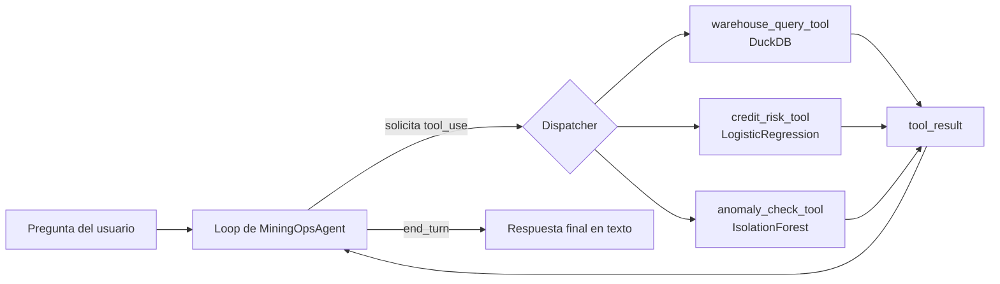
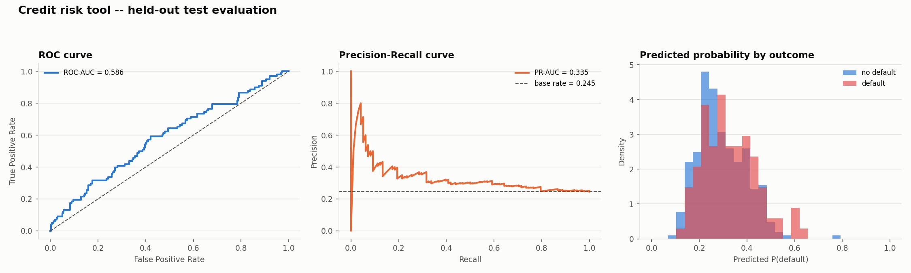
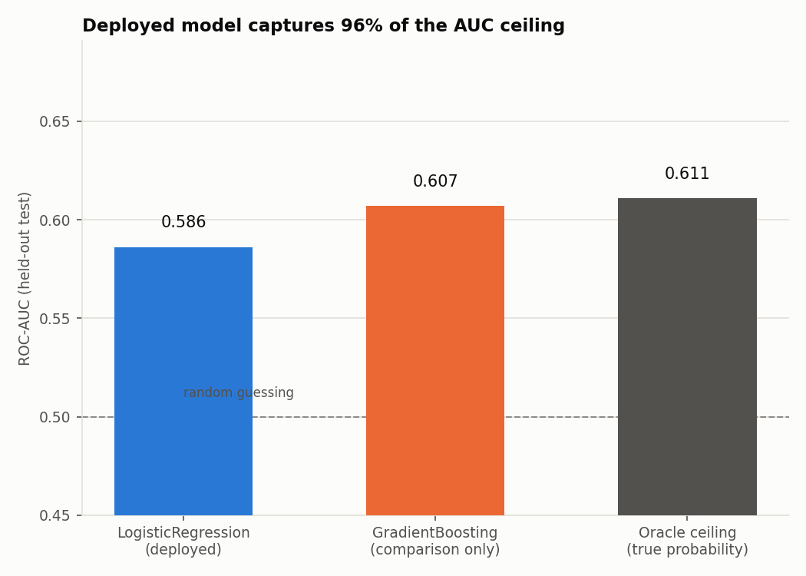
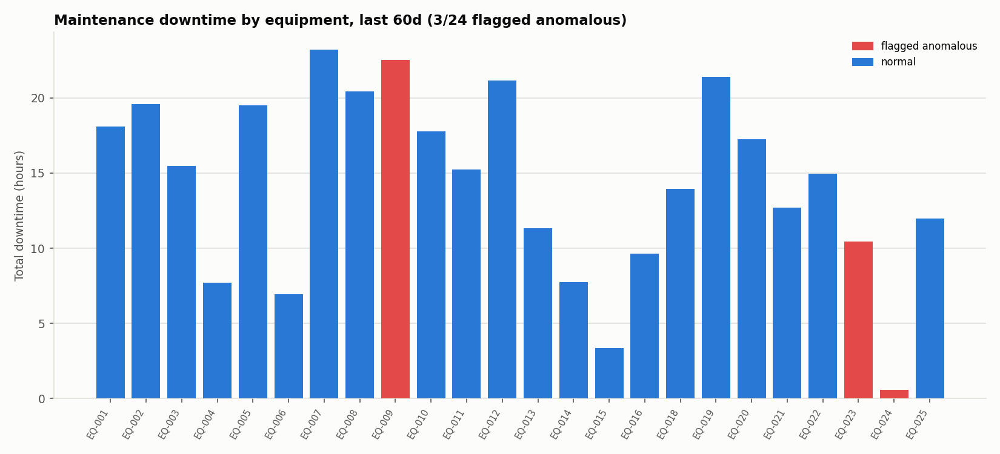
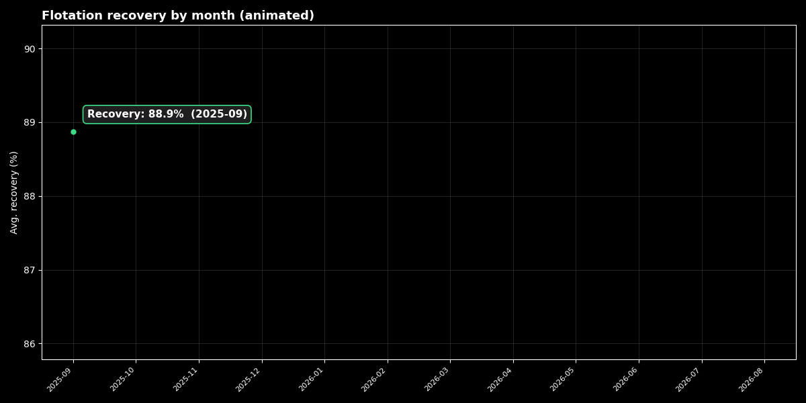
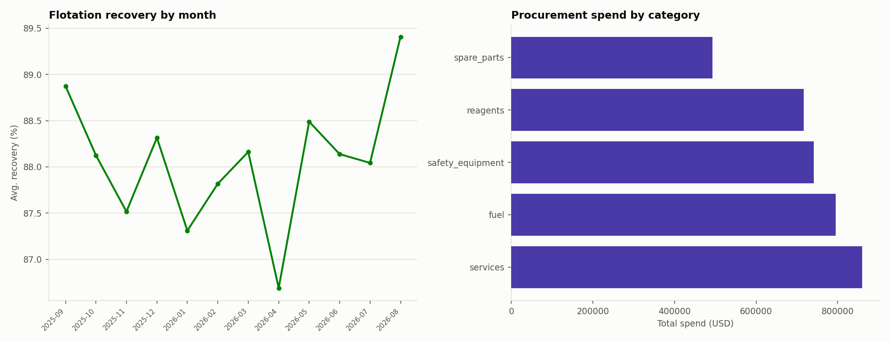

# Chile Mining Ops Agent

*[English version: README.md](README.md)*

[](https://github.com/Rxyxs/chile-mining-ops-agent/actions/workflows/tests.yml)

## Resumen

Construí esto después de notar lo frágil que es un dashboard fijo para el tipo de pregunta que la gente realmente hace sobre una operación minera. Un dashboard responde exactamente las preguntas para las que sus pantallas fueron diseñadas — la recuperación de flotación de este mes, las alertas de mantenimiento de esta semana, el score de riesgo de este solicitante — pero apenas alguien pregunta algo un poco distinto ("¿la recuperación de septiembre fue normal, y algún equipo con mucho downtime también está marcado como anómalo?"), o hace falta una pantalla nueva o alguien corre una consulta ad hoc a mano. Ninguna de las dos opciones escala, y la segunda es justo donde los números se recuerdan mal o se estiman bajo presión de tiempo.

Lo que quise probar acá es si un loop de tool-calling con un LLM da algo mejor que ambas opciones: una interfaz en lenguaje natural que pueda responder un rango más amplio de preguntas ad hoc que cualquier dashboard fijo, pero manteniéndose **anclada a datos reales** — cada número en su respuesta tiene que venir de una llamada a una tool real (una consulta DuckDB real, una predicción de modelo real), no de lo que el modelo adivine que sonaría plausible. Ese es todo el punto de enrutar a través de `tools=[...]` en la API de Anthropic en vez de simplemente pedirle al modelo que responda desde contexto: el modelo puede pedir una tool, pero no puede inventar un `tool_result`.

Todo lo que las herramientas tocan — los datos operacionales y el modelo de riesgo crediticio — es **sintético y generado dentro de este mismo repo**, con semilla fija (`numpy.random.default_rng(42)`), así que todo el pipeline (schema, datos, modelo, tools, tests) es reproducible desde un clone limpio con `python -m src.setup_data`.

## Arquitectura



El loop vive en `src/agent.py` (`MiningOpsAgent`). Envía el mensaje del usuario y los schemas de las tools al modelo; si la respuesta pide `tool_use`, despacha a la función Python correspondiente, empaqueta el resultado (o la excepción, si la tool falló) como `tool_result`, y lo devuelve — con un tope de iteraciones (5 por defecto) para que un modelo que se comporte mal no entre en loop infinito.

## Herramientas expuestas (`src/tools/`)

Las tres son funciones Python planas y síncronas, con un schema JSON asociado (`TOOL_SCHEMAS`) en el formato que espera la API de Anthropic para tool-use (`{"name", "description", "input_schema"}`). Cada una corre, y está testeada, **sin necesitar ningún LLM ni API key**.

| Tool | Archivo | Qué hace |
|---|---|---|
| `get_flotation_summary`, `get_maintenance_alerts`, `get_procurement_summary` | `warehouse_query_tool.py` | Consultas fijas, nombradas y parametrizadas contra un DuckDB local (`data/ops.duckdb`) — **no** SQL arbitrario del usuario, por diseño. |
| `score_credit_risk` | `credit_risk_tool.py` | Puntúa el perfil de un solicitante de crédito con una `LogisticRegression` pequeña y autocontenida, entrenada sobre solicitantes sintéticos (`data/credit_risk_model.joblib`). |
| `check_maintenance_anomalies` | `anomaly_check_tool.py` | Corre un `IsolationForest` sobre eventos de mantenimiento recientes para marcar equipos con patrones anómalos de downtime/severidad. |

El warehouse DuckDB tiene tres tablas sintéticas: `flotation_batches`, `maintenance_events`, `procurement_orders`, todas generadas por `src/setup_data.py` con `numpy.random.default_rng(42)`.

## Técnicas usadas

| Técnica | Dónde | Para qué sirve |
|---|---|---|
| API de tool-use de Anthropic (SDK Python `anthropic`, `messages.create(tools=...)`) | `src/cli.py` | Deja que el modelo decida *qué* tool llamar y con *qué* argumentos, en vez de matching de intención hardcodeado. |
| Loop de agente acotado (`MiningOpsAgent.run`) | `src/agent.py` | Despacha bloques `tool_use` a funciones Python reales, devuelve los `tool_result` al modelo, y limita las iteraciones (5 por defecto) para que un modelo trabado no entre en loop infinito. |
| DuckDB, consultas parametrizadas | `src/tools/warehouse_query_tool.py` | Consultas OLAP locales rápidas sobre el warehouse operacional sintético; los parámetros se bindean (placeholders `?`), nunca SQL armado por interpolación de strings. |
| `LogisticRegression` (scikit-learn) | `src/tools/credit_risk_tool.py`, `src/setup_data.py` | Un modelo de riesgo crediticio pequeño y autocontenido, entrenado sobre datos sintéticos de solicitantes; devuelve una probabilidad de default y un tier de riesgo. |
| `IsolationForest` (scikit-learn) | `src/tools/anomaly_check_tool.py` | Detección de outliers no supervisada sobre features de mantenimiento por equipo (cantidad de eventos, downtime total, proporción de eventos críticos/altos) para marcar equipos anómalos sin un umbral fijado a mano. |
| Verificación de techo AUC vía oráculo (`GradientBoostingClassifier` vs. la probabilidad real generadora) | `src/model_ceiling_check.py` | Verifica que un AUC débil sea ruido propio de la etiqueta, no una elección de modelo corregible, puntuando la probabilidad real detrás de cada etiqueta sintética contra el held-out y comprobando que ningún modelo — desplegado o más flexible — pueda superarla. |
| Cliente Anthropic falso con `unittest.mock` | `tests/test_agent.py` | Verifica la lógica de ruteo del dispatcher (tool correcta, argumentos correctos, forma correcta del `tool_result`, manejo de errores, tope de iteraciones) sin ninguna llamada real a la API. |

## Resultados

Generados por `python -m src.generate_report` (`src/visualization/plots.py`), que llama a las mismas funciones tool que despacha el agente en tiempo de ejecución y grafica sus resultados reales — nada aquí está hardcodeado ni re-simulado por separado de las tools.

| Tool | Métrica | Valor |
|---|---|---|
| `score_credit_risk` | ROC-AUC (test held-out, n=400) | 0,586 |
| `score_credit_risk` | PR-AUC (tasa base 0,245) | 0,335 |
| `score_credit_risk` | Accuracy de test | 0,755 |
| `check_maintenance_anomalies` | Equipos marcados (ventana 60d) | 3 / 24 |
| `get_flotation_summary` | Meses de datos | 12 |

### `score_credit_risk` — débil, y ahora verificado que es casi óptimo, no solo "honesto"



Tres paneles, todos sobre el mismo test held-out (n=400): la curva ROC (izquierda) se pega a la diagonal de "sin habilidad predictiva" — nunca se aleja mucho de ella, que es justo lo que se ve cuando se grafica un ROC-AUC de 0,586 en vez de solo reportar el número. La curva PR (centro) se dispara cerca de recall=0 (un puñado de predicciones de alta probabilidad, confiadas y correctas) y luego decae rápido hacia la tasa base de 0,245, el piso realista al aumentar el recall. El histograma (derecha) hace visible la razón: las distribuciones de probabilidad predicha para "default" y "no default" se solapan casi por completo.

**Ese solapamiento antes solo se afirmaba como "el modelo es deliberadamente simple". Ahora está medido.** `setup_data.py` calcula un `true_prob_default` para cada solicitante sintético antes de lanzar la moneda que decide su etiqueta `default` — así que la probabilidad real detrás de cada etiqueta se conoce, no se estima. Puntuar *esa* probabilidad contra las etiquetas reales del held-out (`src/model_ceiling_check.py`) da el mejor AUC que cualquier modelo podría lograr acá, porque la única aleatoriedad que queda una vez que conoces la probabilidad real es el propio lanzamiento de la moneda:



| Modelo | AUC held-out | % del techo capturado |
|---|---|---|
| Oráculo (probabilidad real, no ajustada a partir de los datos) | **0,611** | 100% (por definición) |
| `LogisticRegression` (desplegado en `score_credit_risk`) | 0,586 | **96,0%** |
| `GradientBoostingClassifier` (solo comparación, no desplegado) | 0,607 | 99,4% |

El modelo logístico desplegado ya captura el 96% del AUC teóricamente disponible — y cambiar a un modelo de gradient boosting considerablemente más flexible solo cierra la brecha restante a 99,4%, no supera el techo. Eso descarta la explicación alternativa obvia para un AUC débil (una elección de modelo poco potente): la etiqueta misma es así de ruidosa por construcción (un lanzamiento de moneda alrededor de una probabilidad que va aproximadamente de 0,04 a 0,88 entre solicitantes), y ningún modelo — por más expresivo que sea — puede predecir mejor que una moneda que no le dejan ver. `tests/test_model_ceiling_check.py` fija esto: verifica que ningún AUC de modelo pueda superar al del oráculo, y que el modelo desplegado capture al menos 85% de él.

**Versión interactiva:** [P(default) predicha vs. debt-to-income, los 400 solicitantes held-out, hover para ver el perfil completo](https://htmlpreview.github.io/?https://github.com/Rxyxs/chile-mining-ops-agent/blob/main/outputs/interactive/credit_risk_scores.html) — abre un gráfico Plotly interactivo en vivo (HTML autocontenido, generado por `plot_credit_risk_interactive()` en `src/visualization/plots.py`) en vez de una imagen estática.

**Dos perfiles reales de solicitante puntuados con `score_credit_risk` (llamado directamente, sin LLM en el loop):**

| Perfil | Edad | Ingreso (CLP/mes) | Debt-to-income | Meses empleado | Pagos atrasados | Solicitado (CLP) | `probability_default` | `risk_tier` |
|---|---|---|---|---|---|---|---|---|
| Ejemplo bajo riesgo | 42 | 1.400.000 | 0,15 | 96 | 0 | 1.500.000 | **0,0823** | **low** |
| Ejemplo alto riesgo | 24 | 380.000 | 0,92 | 3 | 6 | 5.500.000 | **0,7892** | **critical** |

Ambas filas son una llamada real a `score_credit_risk(...)` cada una, corridas en esta sesión contra el modelo versionado en `data/credit_risk_model.joblib` — no elegidas a mano para verse limpias, solo dos perfiles en extremos opuestos de los rangos de entrada con los que se entrenó el modelo.

### `check_maintenance_anomalies` — el downtime no es toda la historia



3 de 24 equipos quedan marcados por el `IsolationForest`, y los marcados **no** son simplemente los tres con más downtime — esa es la parte interesante de este gráfico. EQ-007 tiene más downtime total (23,2h) que el marcado EQ-009 (22,6h) pero no queda marcado; EQ-023 queda marcado con un downtime medio de 10,4h, por debajo de varias barras normales; y EQ-024 queda marcado a pesar de tener casi nada de downtime (0,5h) — anómalo por ser inusualmente *bajo*, no alto. Es lo esperable de un Isolation Forest que corre sobre múltiples features del evento de mantenimiento (frecuencia, severidad, downtime) en vez de un umbral simple de downtime, y es una señal más realista que "marca la barra más alta".

### `get_flotation_summary` / `get_procurement_summary` — el trasfondo operacional




El GIF de arriba anima la tendencia de recuperación de flotación a lo largo de los 12 meses; el PNG de abajo es la referencia estática para lectura detallada.

Izquierda: recuperación promedio mensual de flotación sobre la ventana sintética de 12 meses — oscila en una banda relativamente estrecha de 87–89,5%, con una caída visible a 86,7% en abril de 2026 antes de recuperarse a un máximo de 12 meses de 89,4% en agosto de 2026. Derecha: gasto de procurement por categoría, ordenado `services` > `fuel` > `safety_equipment` > `reagents` > `spare_parts` — `services` y `fuel` juntos representan cerca del 45% del gasto total de procurement en este warehouse sintético, por delante de consumibles como reactivos y repuestos.

**Tres llamadas más a las tools de warehouse, corridas directamente en esta sesión (sin LLM de por medio):**

```text
>>> get_flotation_summary("2025-09")
{'n_batches': 18, 'avg_feed_grade_pct': 0.83, 'avg_recovery_pct': 88.87,
 'avg_concentrate_grade_pct': 28.28, 'total_tonnage_processed': 26282.7, 'month': '2025-09'}

>>> get_procurement_summary("delayed")
{'status_filter': 'delayed', 'n_orders': 66, 'total_amount_usd': 514709.88, 'avg_amount_usd': 7798.63}

>>> check_maintenance_anomalies(days=60)
{'window_days': 60, 'n_equipment_evaluated': 24, 'n_equipment_flagged': 3,
 'flagged': [
   {'equipment_id': 'EQ-009', 'n_events': 7, 'total_downtime_hours': 22.53, 'critical_share': 0.286, 'anomaly_score': -0.0365},
   {'equipment_id': 'EQ-024', 'n_events': 2, 'total_downtime_hours': 0.6,  'critical_share': 0.5,   'anomaly_score': -0.0174},
   {'equipment_id': 'EQ-023', 'n_events': 3, 'total_downtime_hours': 10.46, 'critical_share': 0.667, 'anomaly_score': -0.007}]}
```

## Instalación

```bash
python -m venv .venv
.venv\Scripts\activate       # Windows PowerShell: .venv\Scripts\Activate.ps1
pip install -r requirements.txt
```

## Uso

1. **Generar los datos sintéticos y entrenar el modelo de riesgo:**

   ```bash
   python -m src.setup_data
   ```

   Escribe `data/ops.duckdb` y `data/credit_risk_model.joblib`.

2. **Generar las figuras de resultados y el resumen de métricas:**

   ```bash
   python -m src.generate_report
   ```

   Escribe `reports/figures/*.png`, `reports/figures/*.gif`, `reports/metrics.json`, y `outputs/interactive/credit_risk_scores.html`.

3. **Correr la suite de tests** (funciona completamente offline, sin API key):

   ```bash
   pytest
   ```

4. **Hablar con el agente** (requiere una `ANTHROPIC_API_KEY` real):

   ```bash
   python -m src.cli "¿Cuál fue la recuperación de flotación en septiembre de 2025?"
   ```

   Sin una key configurada, el CLI termina con un mensaje claro en vez de un traceback.

## Nota honesta sobre lo verificado

En el entorno de build de este proyecto **no hay `ANTHROPIC_API_KEY` disponible**, ni en la creación original ni en esta revisión. Eso limita lo que efectivamente se pudo correr y confirmar aquí, y esta sección reporta solo lo que se ejecutó en esta sesión — nada se describe como funcionando si no se corrió de verdad.

**Verificado en esta sesión (clone limpio, virtualenv limpio, comandos reales, output real capturado):**
- `python -m src.setup_data` corre exitosamente y escribe ambos artefactos (precisión de holdout `0,755` impresa y observada, no asumida).
- `python -m src.generate_report` corre exitosamente y escribe las cuatro figuras (`credit_risk_evaluation.png`, `anomaly_scores.png`, `warehouse_overview.png`, `warehouse_overview_animated.gif`) más `reports/metrics.json` y `outputs/interactive/credit_risk_scores.html`, todo a partir de resultados reales de las tools/el modelo.
- `pytest` — **26/26 tests pasando**. Incluye ejecuciones reales de las cinco funciones tool contra el DuckDB y el modelo generados (sin mockear las tools mismas), las cuatro funciones de graficado (verificando que las figuras/el HTML se escriben de verdad a disco con contenido real), el script de reporte, la verificación de techo AUC vía oráculo, más tests del loop del agente que mockean el cliente de Anthropic (`unittest.mock`) para verificar que el dispatcher llama a la tool correcta con los argumentos correctos, arma bien los bloques `tool_result`, maneja excepciones de las tools sin crashear, y respeta el tope de iteraciones. Esta suite ahora también corre en CI (ver el badge arriba) en cada push — ya no depende de que alguien la vuelva a correr manualmente en una sesión para que siga vigente.
- Cada función tool también se invocó manualmente fuera de pytest — las consultas de warehouse, los dos perfiles de riesgo crediticio, y el chequeo de anomalías de arriba son output real copiado, no parafraseado.

**No verificado:**
- Una conversación real end-to-end contra la API real de Anthropic. `src/cli.py` está escrito para hacer esa llamada de verdad (`anthropic.Anthropic()`, modelo `claude-sonnet-5` por defecto), pero nunca se corrió en este entorno porque no hay API key disponible. Cualquiera que clone este repo con su propia `ANTHROPIC_API_KEY` puede correr `python -m src.cli "..."` para probarlo en vivo — ese camino está implementado y testeado a nivel de dispatch (ver `tests/test_agent.py`, que ejercita el mismo loop `MiningOpsAgent.run()` con un cliente falso en lugar de la API real), solo que no se ejercitó contra la API real aquí.

## Decisión de diseño: versionar los datos generados

`data/ops.duckdb`, `data/credit_risk_model.joblib`, `reports/figures/*.png` + `reports/metrics.json`, y `outputs/interactive/credit_risk_scores.html` se versionan en el repo en vez de ignorarse. Son pequeños, sintéticos/derivados, regenerables de forma determinística (`python -m src.setup_data && python -m src.generate_report`), y versionarlos permite que las tools (y los resultados de arriba) sean visibles inmediatamente después de clonar el repo sin un paso de setup obligatorio. El `.gitignore` sigue excluyendo el entorno virtual y las cachés.

## Autor

Pablo Reyes — Data Scientist, Santiago, Chile.
