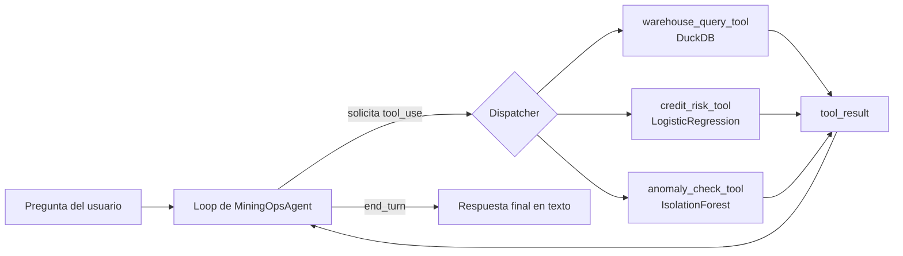

# Chile Mining Ops Agent

*[English version: README.md](README.md)*

## Resumen

Las operaciones mineras y de riesgo en Chile suelen consultarse a través de dashboards fijos: una pantalla para KPIs de flotación, otra para alertas de mantenimiento, otra para un modelo de riesgo crediticio. Este proyecto explora una interfaz distinta: un agente en lenguaje natural que responde preguntas operacionales y de riesgo **llamando herramientas reales** (funciones Python que consultan una base de datos real y un modelo real ya entrenado), sin inventar números.

Es el proyecto #37 de un portafolio construido mayormente sobre modelos tabulares/series de tiempo (baseline + ensamble + PyTorch, comparados entre sí). Ninguno de esos proyectos ejercita tool-calling real con un LLM — este cierra ese hueco.

Todo lo que las herramientas tocan — los datos operacionales y el modelo de riesgo crediticio — es **sintético y generado dentro de este mismo repo**, con semilla fija. No se copia ni se importa nada de otros repositorios del portafolio; la arquitectura se inspira en patrones usados en otros lados (ej. un warehouse DuckDB, un modelo de regresión logística de riesgo) pero los artefactos son autocontenidos y se construyen desde cero aquí.

## Arquitectura



El loop vive en `src/agent.py` (`MiningOpsAgent`). Envía el mensaje del usuario y los schemas de las tools al modelo; si la respuesta pide `tool_use`, despacha a la función Python correspondiente, empaqueta el resultado (o la excepción, si la tool falló) como `tool_result`, y lo devuelve — con un tope de iteraciones (5 por defecto) para que un modelo que se comporte mal no entre en loop infinito.

## Herramientas expuestas (`src/tools/`)

Las tres son funciones Python planas y síncronas, con un schema JSON asociado (`TOOL_SCHEMAS`) en el formato que espera la API de Anthropic para tool-use (`{"name", "description", "input_schema"}`). Cada una corre, y está testeada, **sin necesitar ningún LLM ni API key**.

| Tool | Archivo | Qué hace |
|---|---|---|
| `get_flotation_summary`, `get_maintenance_alerts`, `get_procurement_summary` | `warehouse_query_tool.py` | Consultas fijas, nombradas y parametrizadas contra un DuckDB local (`data/ops.duckdb`) — **no** SQL arbitrario del usuario, por diseño. |
| `score_credit_risk` | `credit_risk_tool.py` | Puntúa el perfil de un solicitante de crédito con una `LogisticRegression` pequeña y autocontenida, entrenada sobre solicitantes sintéticos (`data/credit_risk_model.joblib`). |
| `check_maintenance_anomalies` | `anomaly_check_tool.py` | Corre un `IsolationForest` sobre eventos de mantenimiento recientes para marcar equipos con patrones anómalos de downtime/severidad. |

El warehouse DuckDB tiene tres tablas sintéticas: `flotation_batches`, `maintenance_events`, `procurement_orders`, todas generadas por `src/setup_data.py` con `numpy.random.default_rng(42)`.

## Resultados

Generados por `python -m src.generate_report` (`src/visualization/plots.py`), que llama a las mismas funciones tool que despacha el agente en tiempo de ejecución y grafica sus resultados reales — nada aquí está hardcodeado ni re-simulado por separado de las tools.

| Tool | Métrica | Valor |
|---|---|---|
| `score_credit_risk` | ROC-AUC (test held-out, n=400) | 0,586 |
| `score_credit_risk` | PR-AUC (tasa base 0,245) | 0,335 |
| `score_credit_risk` | Accuracy de test | 0,755 |
| `check_maintenance_anomalies` | Equipos marcados (ventana 60d) | 3 / 24 |
| `get_flotation_summary` | Meses de datos | 12 |

### `score_credit_risk` — débil pero honesto


Tres paneles, todos sobre el mismo test held-out (n=400): la curva ROC (izquierda) se pega a la diagonal de "sin habilidad predictiva" — nunca se aleja mucho de ella, que es justo lo que se ve cuando se grafica un ROC-AUC de 0,586 en vez de solo reportar el número. La curva PR (centro) se dispara cerca de recall=0 (un puñado de predicciones de alta probabilidad, confiadas y correctas) y luego decae rápido hacia la tasa base de 0,245, el piso realista al aumentar el recall. El histograma (derecha) hace visible la razón: las distribuciones de probabilidad predicha para "default" y "no default" se solapan casi por completo — el modelo no puede separar limpiamente ambas clases porque, por diseño, `setup_data.py` genera la probabilidad de default latente a partir de una mezcla ruidosa de solo seis features, puntuada con una `LogisticRegression` simple. Esto no es un bug disimulado — es lo que se ve al evaluar honestamente un modelo de ejemplo deliberadamente simple, en vez de elegir una métrica que esconda el solapamiento.

### `check_maintenance_anomalies` — el downtime no es toda la historia


3 de 24 equipos quedan marcados por el `IsolationForest`, y los marcados **no** son simplemente los tres con más downtime — esa es la parte interesante de este gráfico. EQ-007 tiene más downtime total (23,2h) que el marcado EQ-009 (22,6h) pero no queda marcado; EQ-023 queda marcado con un downtime medio de 10,4h, por debajo de varias barras normales; y EQ-024 queda marcado a pesar de tener casi nada de downtime (0,5h) — anómalo por ser inusualmente *bajo*, no alto. Es lo esperable de un Isolation Forest que corre sobre múltiples features del evento de mantenimiento (frecuencia, severidad, downtime) en vez de un umbral simple de downtime, y es una señal más realista que "marca la barra más alta".

### `get_flotation_summary` / `get_procurement_summary` — el trasfondo operacional


El GIF de arriba anima la tendencia de recuperación de flotación a lo largo de los 12 meses; el PNG de abajo es la referencia estática para lectura detallada.

Izquierda: recuperación promedio mensual de flotación sobre la ventana sintética de 12 meses — oscila en una banda relativamente estrecha de 87–89,5%, con una caída visible a 86,7% en abril de 2026 antes de recuperarse a un máximo de 12 meses de 89,4% en agosto de 2026. Derecha: gasto de procurement por categoría, ordenado `services` > `fuel` > `safety_equipment` > `reagents` > `spare_parts` — `services` y `fuel` juntos representan cerca del 45% del gasto total de procurement en este warehouse sintético, por delante de consumibles como reactivos y repuestos.

## Instalación

```bash
python -m venv .venv
.venv\Scripts\activate       # Windows PowerShell: .venv\Scripts\Activate.ps1
pip install -r requirements.txt
```

## Uso

1. **Generar los datos sintéticos y entrenar el modelo de riesgo:**

   ```bash
   python -m src.setup_data
   ```

   Escribe `data/ops.duckdb` y `data/credit_risk_model.joblib`.

2. **Generar las figuras de resultados y el resumen de métricas:**

   ```bash
   python -m src.generate_report
   ```

   Escribe `reports/figures/*.png` y `reports/metrics.json`.

3. **Correr la suite de tests** (funciona completamente offline, sin API key):

   ```bash
   pytest
   ```

4. **Hablar con el agente** (requiere una `ANTHROPIC_API_KEY` real):

   ```bash
   python -m src.cli "¿Cuál fue la recuperación de flotación en septiembre de 2025?"
   ```

   Sin una key configurada, el CLI termina con un mensaje claro en vez de un traceback.

## Nota honesta sobre lo verificado

En el entorno de build de este proyecto **no hay `ANTHROPIC_API_KEY` disponible**. Eso limita lo que efectivamente se pudo correr y confirmar aquí, y esta sección reporta solo lo que se ejecutó en esta sesión — nada se describe como funcionando si no se corrió de verdad.

**Verificado en esta sesión:**
- `python -m src.setup_data` corre exitosamente y escribe ambos artefactos (la precisión de holdout del modelo de riesgo se imprimió y se observó, no se asumió).
- `python -m src.generate_report` corre exitosamente y escribe las tres figuras más `reports/metrics.json` de arriba, a partir de resultados reales de las tools.
- `pytest` — **22/22 tests pasando**. Incluye ejecuciones reales de las cinco funciones tool contra el DuckDB y el modelo generados (sin mockear las tools mismas), las tres funciones de graficado (verificando que las figuras se escriben de verdad a disco con contenido real), el script de reporte, más tests del loop del agente que mockean el cliente de Anthropic (`unittest.mock`) para verificar que el dispatcher llama a la tool correcta con los argumentos correctos, arma bien los bloques `tool_result`, maneja excepciones de las tools sin crashear, y respeta el tope de iteraciones.
- Cada función tool también se invocó una vez manualmente fuera de pytest y devolvió un resultado real, inspeccionado.

**No verificado:**
- Una conversación real end-to-end contra la API real de Anthropic. `src/cli.py` está escrito para hacer esa llamada de verdad (`anthropic.Anthropic()`, modelo `claude-sonnet-5` por defecto), pero nunca se corrió en este entorno porque no hay API key disponible. Cualquiera que clone este repo con su propia `ANTHROPIC_API_KEY` puede correr `python -m src.cli "..."` para probarlo en vivo — ese camino está implementado y testeado a nivel de dispatch, solo que no se ejercitó contra la API real aquí.

## Decisión de diseño: versionar los datos generados

`data/ops.duckdb`, `data/credit_risk_model.joblib`, y `reports/figures/*.png` + `reports/metrics.json` se versionan en el repo en vez de ignorarse. Son pequeños, sintéticos/derivados, regenerables de forma determinística (`python -m src.setup_data && python -m src.generate_report`), y versionarlos permite que las tools (y los resultados de arriba) sean visibles inmediatamente después de clonar el repo sin un paso de setup obligatorio. El `.gitignore` sigue excluyendo el entorno virtual y las cachés.

## Autor

Pablo Reyes — Data Scientist, Santiago, Chile.
