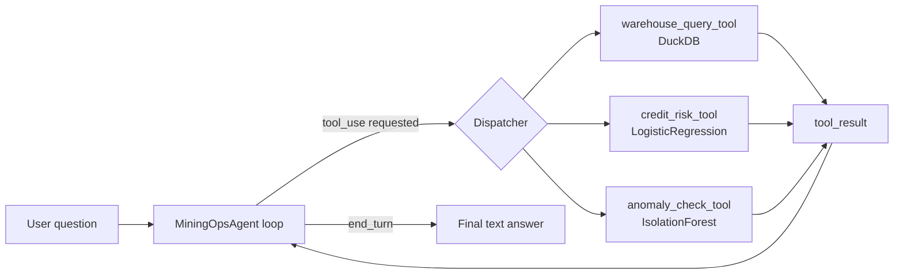

# Chile Mining Ops Agent

*[Version en español: README.es.md](README.es.md)*

## Overview

Chilean mining/fintech operations are usually queried through fixed dashboards: one screen for flotation KPIs, another for maintenance alerts, a third for a credit-risk model. This project explores a different interface: a natural-language agent that answers operational and risk questions by **calling real tools** (Python functions hitting an actual database and an actual trained model), not by hallucinating numbers.

It is project #37 in a portfolio otherwise built around tabular/time-series models (baseline + ensemble + PyTorch, compared head-to-head). None of those projects exercise real LLM tool-calling — this one closes that gap.

Everything a tool touches — the operational data and the credit-risk model — is **synthetic and generated inside this repo**, with a fixed random seed. Nothing is copied or imported from other repositories in the portfolio; the architecture mirrors patterns used elsewhere (e.g. a DuckDB warehouse, a logistic-regression risk model) but the artifacts themselves are self-contained and built fresh here.

## Architecture



The loop lives in `src/agent.py` (`MiningOpsAgent`). It sends the user message and the tool schemas to the model; if the response asks for `tool_use`, it dispatches to the matching Python function, wraps the result (or the exception, if the tool raised one) as a `tool_result`, and sends it back — up to a bounded number of iterations (default 5) so a misbehaving model can't loop forever.

## Tools exposed (`src/tools/`)

All three are plain, synchronous Python functions with a companion JSON schema (`TOOL_SCHEMAS`) in the shape the Anthropic API expects for tool-use (`{"name", "description", "input_schema"}`). Each one runs, and is tested, with **no LLM and no API key involved**.

| Tool | File | What it does |
|---|---|---|
| `get_flotation_summary`, `get_maintenance_alerts`, `get_procurement_summary` | `warehouse_query_tool.py` | Fixed, named, parameterized queries against a local DuckDB (`data/ops.duckdb`) — **not** arbitrary SQL from the user, by design. |
| `score_credit_risk` | `credit_risk_tool.py` | Scores a credit applicant profile with a small self-contained `LogisticRegression` trained on synthetic applicants (`data/credit_risk_model.joblib`). |
| `check_maintenance_anomalies` | `anomaly_check_tool.py` | Runs an `IsolationForest` over recent maintenance events to flag equipment with unusual downtime/severity patterns. |

The DuckDB warehouse has three synthetic tables: `flotation_batches`, `maintenance_events`, `procurement_orders`, all generated by `src/setup_data.py` with `numpy.random.default_rng(42)`.

## Results

Generated by `python -m src.generate_report` (`src/visualization/plots.py`), which calls the same tool functions the agent dispatches at runtime and plots their real outputs — nothing here is hardcoded or re-simulated separately from the tools.

| Tool | Metric | Value |
|---|---|---|
| `score_credit_risk` | ROC-AUC (held-out test, n=400) | 0.586 |
| `score_credit_risk` | PR-AUC (base rate 0.245) | 0.335 |
| `score_credit_risk` | Test accuracy | 0.755 |
| `check_maintenance_anomalies` | Equipment flagged (60d window) | 3 / 24 |
| `get_flotation_summary` | Months of data | 12 |

### `score_credit_risk` — weak but honest


Three panels, all from the same held-out test set (n=400): the ROC curve (left) hugs the no-skill diagonal — it never gets far above it, which is what a ROC-AUC of 0.586 looks like when you actually plot it instead of just reporting the number. The PR curve (center) spikes near recall=0 (a handful of confident, correct high-probability predictions) and then decays fast toward the 0.245 base rate, which is the realistic floor once recall increases. The histogram (right) makes the reason visible: the predicted-probability distributions for "default" and "no default" overlap almost completely — the model can't cleanly separate the two classes because, by design, `setup_data.py` generates the latent default probability from a noisy mix of only six features scored with a plain `LogisticRegression`. This isn't a bug being hidden — it's what a deliberately simple example model looks like when evaluated honestly instead of cherry-picking a metric that hides the overlap.

### `check_maintenance_anomalies` — downtime isn't the whole story


3 of 24 pieces of equipment get flagged by the `IsolationForest`, and the flagged ones are **not** simply the three with the most downtime — that's the interesting part of this chart. EQ-007 has more total downtime (23.2h) than the flagged EQ-009 (22.6h) but isn't flagged; EQ-023 gets flagged at a mid-range 10.4h, well below several normal bars; and EQ-024 is flagged despite having almost no downtime at all (0.5h) — anomalous for being unusually *low*, not high. That's expected from an Isolation Forest run over multiple maintenance-event features (frequency, severity, downtime) rather than a single downtime threshold, and it's a more realistic signal than "flag whatever has the biggest bar."

### `get_flotation_summary` / `get_procurement_summary` — the operational backdrop


The GIF above animates the flotation recovery trend across the 12 months; the PNG below is the static reference for detailed reading.

Left: monthly average flotation recovery over the synthetic 12-month window — it oscillates in a fairly tight 87–89.5% band, with a visible dip to 86.7% in April 2026 before recovering to a 12-month high of 89.4% in August 2026. Right: procurement spend by category, ranked `services` > `fuel` > `safety_equipment` > `reagents` > `spare_parts` — `services` and `fuel` alone account for roughly 45% of total procurement spend in this synthetic warehouse, ahead of consumables like reagents and spare parts.

## Installation

```bash
python -m venv .venv
.venv\Scripts\activate       # Windows PowerShell: .venv\Scripts\Activate.ps1
pip install -r requirements.txt
```

## Usage

1. **Generate the synthetic data and train the risk model:**

   ```bash
   python -m src.setup_data
   ```

   Writes `data/ops.duckdb` and `data/credit_risk_model.joblib`.

2. **Generate the result figures and metrics summary:**

   ```bash
   python -m src.generate_report
   ```

   Writes `reports/figures/*.png` and `reports/metrics.json`.

3. **Run the test suite** (works fully offline, no API key needed):

   ```bash
   pytest
   ```

4. **Talk to the agent** (requires a real `ANTHROPIC_API_KEY`):

   ```bash
   python -m src.cli "What was the flotation recovery in September 2025?"
   ```

   Without a key set, the CLI exits with a clear message instead of a traceback.

## Honest note on what was verified

There is **no `ANTHROPIC_API_KEY` in the build environment this project was created in**. That constrains what could actually be run and confirmed here, and this section reports only what was executed in this session — nothing is described as working unless it was.

**Verified in this session:**
- `python -m src.setup_data` runs successfully and writes both artifacts (holdout accuracy of the credit-risk model was printed and observed, not just assumed).
- `python -m src.generate_report` runs successfully and writes the three figures plus `reports/metrics.json` above from real tool outputs.
- `pytest` — **22/22 tests passing**. This includes real executions of all five tool functions against the generated DuckDB and model (no mocking of the tools themselves), the three plotting functions (asserting figures are actually written to disk with real content), the report script, plus agent-loop tests that mock the Anthropic client (`unittest.mock`) to verify the dispatcher calls the right tool with the right arguments, builds correct `tool_result` blocks, handles tool exceptions without crashing, and respects the max-iteration bound.
- Each tool function was also invoked once manually outside pytest and returned a real, inspected result.

**Not verified:**
- A real end-to-end conversation against the live Anthropic API. `src/cli.py` is written to make that call for real (`anthropic.Anthropic()`, model `claude-sonnet-5` by default), but it was never run in this environment because no API key is available. Anyone cloning this repo with their own `ANTHROPIC_API_KEY` set can run `python -m src.cli "..."` to try it live — that path is implemented and unit-tested at the dispatch level, just not exercised against the real API here.

## Design decision: versioning the generated data

`data/ops.duckdb`, `data/credit_risk_model.joblib`, and `reports/figures/*.png` + `reports/metrics.json` are committed to the repo rather than gitignored. They are small, fully synthetic/derived, deterministically regenerable (`python -m src.setup_data && python -m src.generate_report`), and versioning them means the tools (and the results above) are visible immediately after a clone without a mandatory setup step. `.gitignore` still excludes the virtual environment and caches.

## Author

Pablo Reyes — Data Scientist, Santiago, Chile.
