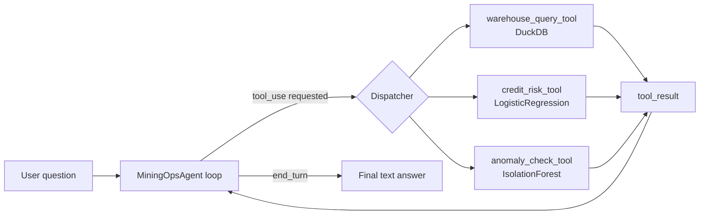

# Chile Mining Ops Agent

*[Version en español: README.es.md](README.es.md)*

[](https://github.com/Rxyxs/chile-mining-ops-agent/actions/workflows/tests.yml)

## Overview

I built this after noticing how brittle a fixed dashboard is for the kind of question people actually ask about a mining operation. A dashboard answers exactly the questions its screens were designed for — this month's flotation recovery, this week's maintenance alerts, this applicant's risk score — but the moment someone asks something slightly off that shape ("was September's recovery normal, and is any of the equipment that's been down a lot also flagged as anomalous?"), you either need a new screen or someone runs an ad hoc query by hand. Neither scales, and the second one is exactly where numbers get misremembered or fudged under time pressure.

What I wanted to test here is whether an LLM tool-calling loop gives you something better than either option: a natural-language front end that can answer a wider range of ad hoc questions than any fixed dashboard, while staying **grounded** — every number in its answer has to come from an actual tool call (a real DuckDB query, a real model prediction), not from the model's own guess at what a plausible-sounding number would be. That's the whole point of routing through `tools=[...]` in the Anthropic API instead of just asking the model to answer from context: the model can request a tool, but it cannot fabricate a `tool_result`.

Everything a tool touches — the operational data and the credit-risk model — is **synthetic and generated inside this repo**, with a fixed random seed (`numpy.random.default_rng(42)`), so the whole pipeline (schema, data, model, tools, tests) is reproducible from a clean clone with `python -m src.setup_data`.

## Architecture



The loop lives in `src/agent.py` (`MiningOpsAgent`). It sends the user message and the tool schemas to the model; if the response asks for `tool_use`, it dispatches to the matching Python function, wraps the result (or the exception, if the tool raised one) as a `tool_result`, and sends it back — up to a bounded number of iterations (default 5) so a misbehaving model can't loop forever.

## Tools exposed (`src/tools/`)

All three are plain, synchronous Python functions with a companion JSON schema (`TOOL_SCHEMAS`) in the shape the Anthropic API expects for tool-use (`{"name", "description", "input_schema"}`). Each one runs, and is tested, with **no LLM and no API key involved**.

| Tool | File | What it does |
|---|---|---|
| `get_flotation_summary`, `get_maintenance_alerts`, `get_procurement_summary` | `warehouse_query_tool.py` | Fixed, named, parameterized queries against a local DuckDB (`data/ops.duckdb`) — **not** arbitrary SQL from the user, by design. |
| `score_credit_risk` | `credit_risk_tool.py` | Scores a credit applicant profile with a small self-contained `LogisticRegression` trained on synthetic applicants (`data/credit_risk_model.joblib`). |
| `check_maintenance_anomalies` | `anomaly_check_tool.py` | Runs an `IsolationForest` over recent maintenance events to flag equipment with unusual downtime/severity patterns. |

The DuckDB warehouse has three synthetic tables: `flotation_batches`, `maintenance_events`, `procurement_orders`, all generated by `src/setup_data.py` with `numpy.random.default_rng(42)`.

## Techniques used

| Technique | Where | What it's for |
|---|---|---|
| Anthropic tool-use API (`anthropic` Python SDK, `messages.create(tools=...)`) | `src/cli.py` | Lets the model decide *which* tool to call and with *what* arguments, instead of hand-coded intent matching. |
| Bounded agent loop (`MiningOpsAgent.run`) | `src/agent.py` | Dispatches `tool_use` blocks to real Python functions, feeds `tool_result`s back to the model, and caps iterations (default 5) so a stuck model can't loop forever. |
| DuckDB, parameterized queries | `src/tools/warehouse_query_tool.py` | Fast local OLAP queries over the synthetic operations warehouse; parameters are bound (`?` placeholders), never string-interpolated SQL. |
| `LogisticRegression` (scikit-learn) | `src/tools/credit_risk_tool.py`, `src/setup_data.py` | A small, self-contained credit-risk scoring model trained on synthetic applicant data; returns a probability of default and a risk tier. |
| `IsolationForest` (scikit-learn) | `src/tools/anomaly_check_tool.py` | Unsupervised outlier detection over per-equipment maintenance features (event count, total downtime, share of critical/high-severity events) to flag anomalous equipment without a hand-set threshold. |
| Oracle-AUC ceiling check (`GradientBoostingClassifier` vs. the true generating probability) | `src/model_ceiling_check.py` | Verifies a weak AUC is the label's own noise, not a fixable model choice, by scoring the true probability behind each synthetic label against the held-out set and checking no model — deployed or more flexible — can beat it. |
| `unittest.mock` fake Anthropic client | `tests/test_agent.py` | Verifies the dispatcher's routing logic (correct tool, correct args, correct `tool_result` shape, error handling, iteration cap) without a real API call. |

## Results

Generated by `python -m src.generate_report` (`src/visualization/plots.py`), which calls the same tool functions the agent dispatches at runtime and plots their real outputs — nothing here is hardcoded or re-simulated separately from the tools.

| Tool | Metric | Value |
|---|---|---|
| `score_credit_risk` | ROC-AUC (held-out test, n=400) | 0.586 |
| `score_credit_risk` | PR-AUC (base rate 0.245) | 0.335 |
| `score_credit_risk` | Test accuracy | 0.755 |
| `check_maintenance_anomalies` | Equipment flagged (60d window) | 3 / 24 |
| `get_flotation_summary` | Months of data | 12 |

### `score_credit_risk` — weak, and now verified to be near-optimal, not just "honest"


Three panels, all from the same held-out test set (n=400): the ROC curve (left) hugs the no-skill diagonal — it never gets far above it, which is what a ROC-AUC of 0.586 looks like when you actually plot it instead of just reporting the number. The PR curve (center) spikes near recall=0 (a handful of confident, correct high-probability predictions) and then decays fast toward the 0.245 base rate, which is the realistic floor once recall increases. The histogram (right) makes the reason visible: the predicted-probability distributions for "default" and "no default" overlap almost completely.

**That overlap used to just be asserted as "the model is deliberately simple." It's now measured.** `setup_data.py` computes a `true_prob_default` for every synthetic applicant before flipping the coin that decides their `default` label — so the true probability behind each label is known, not estimated. Scoring *that* probability against the real held-out labels (`src/model_ceiling_check.py`) gives the best AUC any model could ever achieve here, because the only randomness left once you know the true probability is the coin flip itself:


| Model | Held-out AUC | % of ceiling captured |
|---|---|---|
| Oracle (true probability, not fit from data) | **0.611** | 100% (by definition) |
| `LogisticRegression` (deployed in `score_credit_risk`) | 0.586 | **96.0%** |
| `GradientBoostingClassifier` (comparison only, not deployed) | 0.607 | 99.4% |

The deployed logistic model is already capturing 96% of the AUC that is theoretically available — and swapping in a considerably more flexible gradient-boosted model only closes the remaining gap to 99.4%, it doesn't blow past the ceiling. That rules out the obvious alternative explanation for a weak AUC (an underpowered model choice): the label itself is this noisy by construction (a Bernoulli draw around a probability that only ranges roughly 0.04–0.88 across applicants), and no model — however expressive — can out-predict a coin flip it doesn't get to see. `tests/test_model_ceiling_check.py` locks this in: it asserts no model's AUC can exceed the oracle's, and that the deployed model captures at least 85% of it.

**Interactive version:** [predicted P(default) vs. debt-to-income, all 400 held-out applicants, hover for the full profile](https://htmlpreview.github.io/?https://github.com/Rxyxs/chile-mining-ops-agent/blob/main/outputs/interactive/credit_risk_scores.html) — opens a live Plotly chart (self-contained HTML, generated by `plot_credit_risk_interactive()` in `src/visualization/plots.py`) rather than a static image.

**Two real applicant profiles scored with `score_credit_risk` (called directly, no LLM in the loop):**

| Profile | Age | Income (CLP/mo) | Debt-to-income | Months employed | Late payments | Requested (CLP) | `probability_default` | `risk_tier` |
|---|---|---|---|---|---|---|---|---|
| Low-risk example | 42 | 1,400,000 | 0.15 | 96 | 0 | 1,500,000 | **0.0823** | **low** |
| High-risk example | 24 | 380,000 | 0.92 | 3 | 6 | 5,500,000 | **0.7892** | **critical** |

Both rows are one real call to `score_credit_risk(...)` each, run in this session against the model committed at `data/credit_risk_model.joblib` — not hand-picked to look clean, just two profiles at opposite ends of the input ranges the model was trained on.

### `check_maintenance_anomalies` — downtime isn't the whole story


3 of 24 pieces of equipment get flagged by the `IsolationForest`, and the flagged ones are **not** simply the three with the most downtime — that's the interesting part of this chart. EQ-007 has more total downtime (23.2h) than the flagged EQ-009 (22.6h) but isn't flagged; EQ-023 gets flagged at a mid-range 10.4h, well below several normal bars; and EQ-024 is flagged despite having almost no downtime at all (0.5h) — anomalous for being unusually *low*, not high. That's expected from an Isolation Forest run over multiple maintenance-event features (frequency, severity, downtime) rather than a single downtime threshold, and it's a more realistic signal than "flag whatever has the biggest bar."

### `get_flotation_summary` / `get_procurement_summary` — the operational backdrop


The GIF above animates the flotation recovery trend across the 12 months; the PNG below is the static reference for detailed reading.

Left: monthly average flotation recovery over the synthetic 12-month window — it oscillates in a fairly tight 87–89.5% band, with a visible dip to 86.7% in April 2026 before recovering to a 12-month high of 89.4% in August 2026. Right: procurement spend by category, ranked `services` > `fuel` > `safety_equipment` > `reagents` > `spare_parts` — `services` and `fuel` alone account for roughly 45% of total procurement spend in this synthetic warehouse, ahead of consumables like reagents and spare parts.

**Three more warehouse tool calls, run directly in this session (no LLM involved):**

```text
>>> get_flotation_summary("2025-09")
{'n_batches': 18, 'avg_feed_grade_pct': 0.83, 'avg_recovery_pct': 88.87,
 'avg_concentrate_grade_pct': 28.28, 'total_tonnage_processed': 26282.7, 'month': '2025-09'}

>>> get_procurement_summary("delayed")
{'status_filter': 'delayed', 'n_orders': 66, 'total_amount_usd': 514709.88, 'avg_amount_usd': 7798.63}

>>> check_maintenance_anomalies(days=60)
{'window_days': 60, 'n_equipment_evaluated': 24, 'n_equipment_flagged': 3,
 'flagged': [
   {'equipment_id': 'EQ-009', 'n_events': 7, 'total_downtime_hours': 22.53, 'critical_share': 0.286, 'anomaly_score': -0.0365},
   {'equipment_id': 'EQ-024', 'n_events': 2, 'total_downtime_hours': 0.6,  'critical_share': 0.5,   'anomaly_score': -0.0174},
   {'equipment_id': 'EQ-023', 'n_events': 3, 'total_downtime_hours': 10.46, 'critical_share': 0.667, 'anomaly_score': -0.007}]}
```

## Installation

```bash
python -m venv .venv
.venv\Scripts\activate       # Windows PowerShell: .venv\Scripts\Activate.ps1
pip install -r requirements.txt
```

## Usage

1. **Generate the synthetic data and train the risk model:**

   ```bash
   python -m src.setup_data
   ```

   Writes `data/ops.duckdb` and `data/credit_risk_model.joblib`.

2. **Generate the result figures and metrics summary:**

   ```bash
   python -m src.generate_report
   ```

   Writes `reports/figures/*.png`, `reports/figures/*.gif`, `reports/metrics.json`, and `outputs/interactive/credit_risk_scores.html`.

3. **Run the test suite** (works fully offline, no API key needed):

   ```bash
   pytest
   ```

4. **Talk to the agent** (requires a real `ANTHROPIC_API_KEY`):

   ```bash
   python -m src.cli "What was the flotation recovery in September 2025?"
   ```

   Without a key set, the CLI exits with a clear message instead of a traceback.

## Honest note on what was verified

There is **no `ANTHROPIC_API_KEY` in the build environment this project was created and revised in**. That constrains what could actually be run and confirmed here, and this section reports only what was executed in this session — nothing is described as working unless it was.

**Verified in this session (fresh clone, fresh virtualenv, real commands, real output captured):**
- `python -m src.setup_data` runs successfully and writes both artifacts (holdout accuracy `0.755` was printed and observed, not just assumed).
- `python -m src.generate_report` runs successfully and writes all four figures (`credit_risk_evaluation.png`, `anomaly_scores.png`, `warehouse_overview.png`, `warehouse_overview_animated.gif`) plus `reports/metrics.json` and `outputs/interactive/credit_risk_scores.html`, all from real tool/model outputs.
- `pytest` — **26/26 tests passing**. This includes real executions of all five tool functions against the generated DuckDB and model (no mocking of the tools themselves), the four plotting functions (asserting figures/HTML are actually written to disk with real content), the report script, the oracle-vs-fitted-model AUC ceiling check, plus agent-loop tests that mock the Anthropic client (`unittest.mock`) to verify the dispatcher calls the right tool with the right arguments, builds correct `tool_result` blocks, handles tool exceptions without crashing, and respects the max-iteration bound. This suite now also runs in CI (see the badge at the top) on every push — it no longer depends on someone manually re-running it in a session to stay current.
- Each tool function was also invoked manually outside pytest — the warehouse queries, both credit-risk profiles, and the anomaly check shown above are copy-pasted real output, not paraphrased.

**Not verified:**
- A real end-to-end conversation against the live Anthropic API. `src/cli.py` is written to make that call for real (`anthropic.Anthropic()`, model `claude-sonnet-5` by default), but it was never run in this environment because no API key is available. Anyone cloning this repo with their own `ANTHROPIC_API_KEY` set can run `python -m src.cli "..."` to try it live — that path is implemented and unit-tested at the dispatch level (see `tests/test_agent.py`, which drives the exact same `MiningOpsAgent.run()` loop with a fake client standing in for the real API), just not exercised against the real API here.

## Design decision: versioning the generated data

`data/ops.duckdb`, `data/credit_risk_model.joblib`, `reports/figures/*.png` + `reports/metrics.json`, and `outputs/interactive/credit_risk_scores.html` are committed to the repo rather than gitignored. They are small, fully synthetic/derived, deterministically regenerable (`python -m src.setup_data && python -m src.generate_report`), and versioning them means the tools (and the results above) are visible immediately after a clone without a mandatory setup step. `.gitignore` still excludes the virtual environment and caches.

## Author

Pablo Reyes — Data Scientist, Santiago, Chile.
